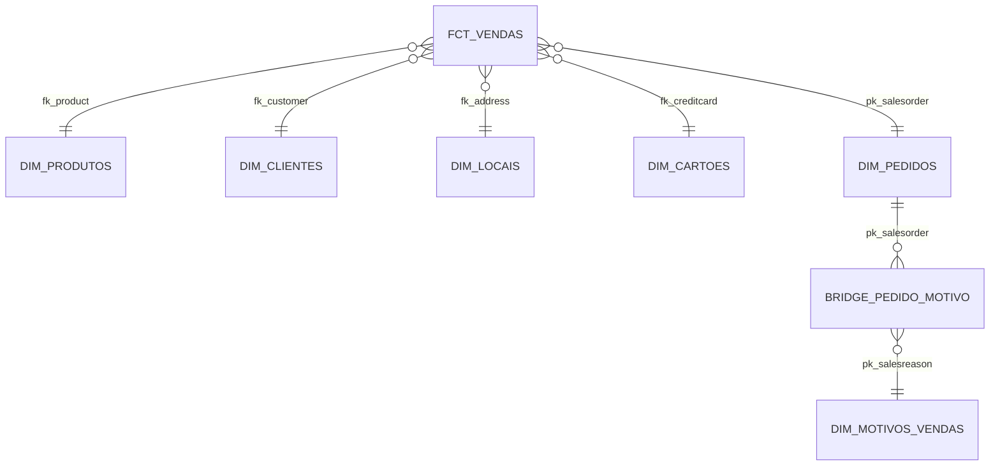

# Projeto dbt Adventure Works

Este repositório contém o projeto dbt para a transformação de dados do banco de dados Adventure Works. O objetivo é transformar os dados brutos (camada raw) em um modelo dimensional pronto para análise e Business Intelligence.

## 🚀 Visão Geral

O projeto utiliza o **dbt (data build tool)** para realizar a modelagem e transformação dos dados hospedados no **Databricks**. A arquitetura segue as melhores práticas de modelagem dbt, dividindo o processo em camadas:

1.  **Staging (Bronze/Silver):** Limpeza inicial, renomeação de colunas e tipagem básica dos dados brutos.
2.  **Marts (Gold):** Tabelas finais organizadas em um esquema Estrela (Star Schema), com dimensões e fatos.

## 📂 Estrutura de Pastas

```text
├── models/
│   ├── staging/        # Camada de limpeza e padronização (stg_adw__*)
│   └── marts/          # Modelo dimensional final
│       ├── dimensions/ # Dimensões (dim_*)
│       └── facts/      # Tabelas fato (fct_*)
├── tests/              # Testes customizados de qualidade de dados
├── macros/             # Macros reutilizáveis para SQL
└── seeds/              # Dados estáticos carregados via CSV
```

## 🏗️ Modelagem de Dados

O projeto segue um modelo **Star Schema** para otimizar a performance analítica.

### Diagrama Conceitual (Mermaid)



### Principais Modelos

#### Dimensões
-   `dim_produtos`: Informações detalhadas sobre os produtos.
-   `dim_clientes`: Dados dos clientes (Pessoas e Lojas).
-   `dim_locais`: Endereços, cidades, estados e países.
-   `dim_cartoes`: Informações sobre cartões de crédito.
-   `dim_pedidos`: Atributos do cabeçalho do pedido (status, valores totais).
-   `dim_motivos_vendas`: Catálogo de motivos de venda.

#### Fatos
-   `fct_vendas`: Tabela fato principal, com grão por item de pedido. Contém métricas de faturamento bruto, líquido e quantidade.

#### Bridge
-   `bridge_pedido_motivo_venda`: Resolve o relacionamento N:N entre pedidos e seus múltiplos motivos de venda.

## ✅ Requisitos do Desafio

- [x] **Sources configuradas:** Mapeadas em `sources.yml`.
- [x] **Camadas Staging e Marts:** Implementadas e separadas por pastas.
- [x] **Documentação:** Colunas e modelos documentados nos arquivos `.yml`.
- [x] **Testes de Source/PK:** Implementados testes de `not_null`, `unique` e `relationships`.
- [x] **Teste de Vendas 2011:** Localizado em `tests/test_vendas_brutas_2011.sql`, validando o valor total de R$ 12.646.112,16.

## 🛠️ Como Executar o Projeto

### Pré-requisitos
-   Python 3.8+
-   dbt-core e dbt-databricks

### Passo a Passo

1.  **Clone e Instale:**
    ```bash
    git clone [url-do-repositorio]
    dbt deps
    ```

2.  **Configure o profiles.yml:**
    Utilize o arquivo `profiles.yml` de exemplo na raiz como referência.

3.  **Execute e Teste:**
    ```bash
    dbt run
    dbt test
    ```

---
Projeto desenvolvido como parte da formação em Engenharia de Dados.
